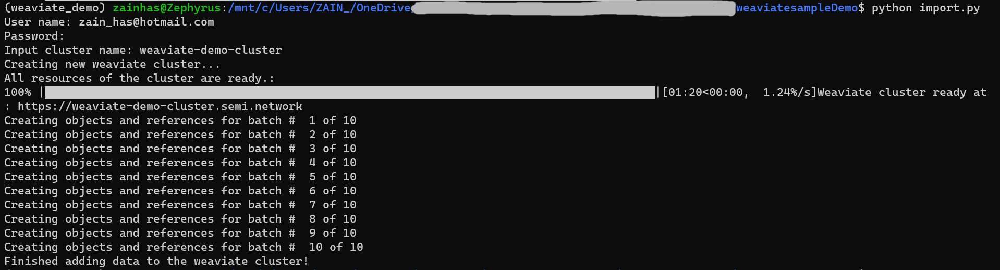
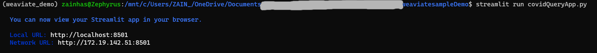

<h1 align="center">COVID-19 Publications Weaviate Demo App</h1>

<!-- ABOUT THE PROJECT -->
<h3 align="center">In this project we will upload COVID-19 related academic publications to Weaviate, a vector database, and then query for publications related to specific topics. The goal is to create a tool that can help people search for scientifically accurate articles related to COVID.

![Product Name Screen Shot][product-screenshot]
</h3>

### This tutorial will help you understand:
1. How the weaviate platform works
2. How to create a weaviate cluster using Weaviate Cloud Services (WCS)
3. How to create a schema
4. How to upload data to the weaviate cluster using batches
5. How we can create a Streamlit app that can be used to query the database for relevant COVID-19 publications.

<!-- GETTING STARTED -->
## Getting Started

To get a local copy up and running follow these simple steps.

### Installation

1. Create a free Weaviate Cloud Services account at [console.semi.technology/](https://console.semi.technology/)
2. Clone the repo
   ```sh
   git clone https://github.com/zainhas/weaviatedemo.git
   ```
3. Install requirements in a new conda virtual environment
   ```sh
   conda install --file requirements.txt
   ```
   
4. Download that data from this [google drive link](https://drive.google.com/file/d/1mgoiKSavy0GAGdejxfA0yjX-cgTuCUfG/view?usp=sharing) and place it in the `data` folder.

5. Run the `import.py` file in a terminal, which will ask you for your WCS credentials and to name your weaviate cluster to be created. This script will then create the weaviate cluster and upload data to it.
   ```sh
   python import.py
   ```
   You should see the following output in your terminal:
   
   
   
6. Run the `covidQueryApp.py` streamlit app which will start the streamlit app.
   ```sh
   streamlit run covidQueryApp.py
   ```
   You should see the following output in your terminal:
   
   
   
7. You can now navigate to the Local URL where your demo app is launched. You will need to provide the same weaviate cluster name to connect to it.

8. Enter topics to query COVID related publication with. You can even expand the articles to read thier abstracts!

<!-- FILES INCLUDED -->
## Files Included

Below is a description of all the files included in this tutorial.

1. `import.py` - A python script that will start a weaviate cluster and upload data to this cluster
2. `covidQueryApp.py` - A streamlit app that will allow you to query and search your weaviate database for relevant articles
3. `batchHelper.py` - Contains functions to help with uploading data to the weaviate cluster.
4. `data/covid_articles.csv` - a .csv file containing COVID-19 related publication data
5. `requirements.txt` - contains all the packages you need to run this tutorial
6. `schema.json` - contains the schema for our database
7. `helper.py` - contains helper functions to clean and format out data

<p align="right">(<a href="#readme-top">back to top</a>)</p>


<!-- MARKDOWN LINKS & IMAGES -->
[product-screenshot]: images/appDemo.png
[term0-screenshot]: images/term0.png
[term1-screenshot]: images/term1.png
